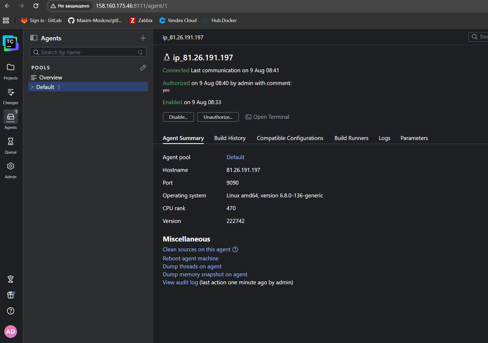
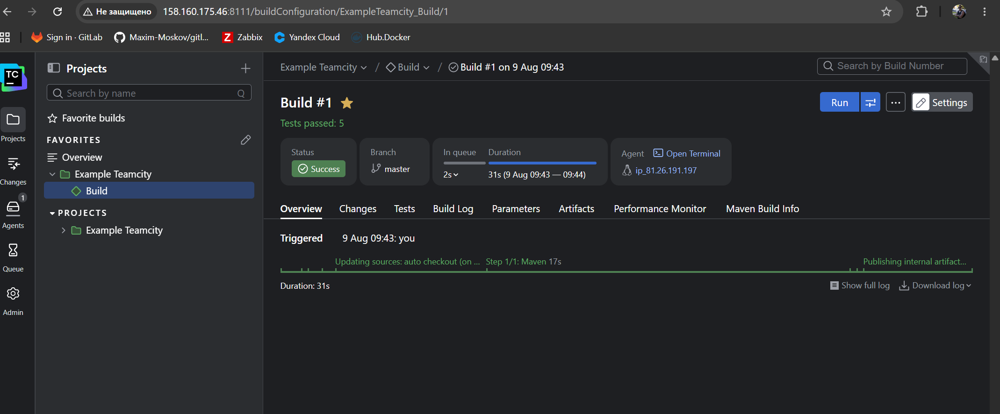
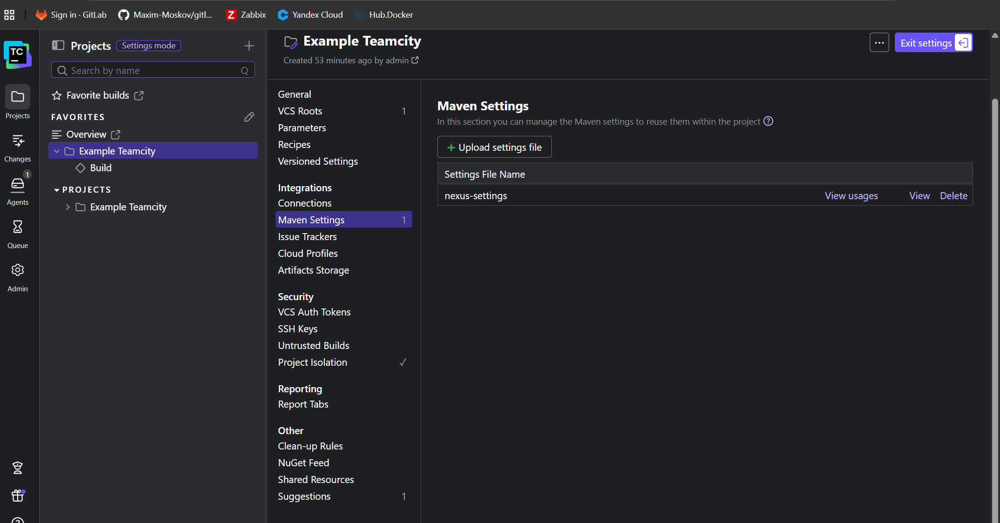
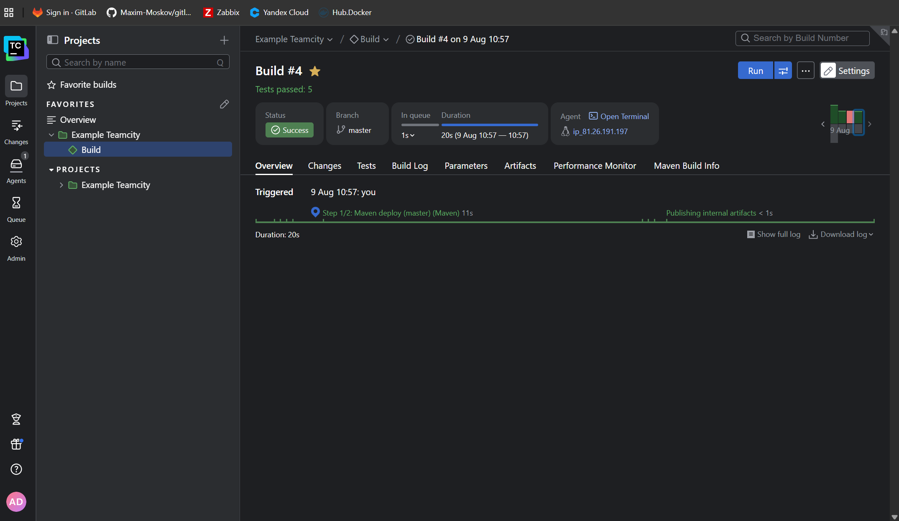
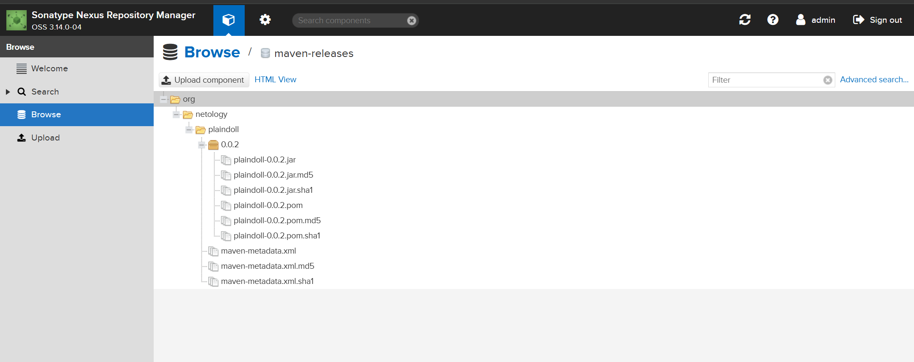
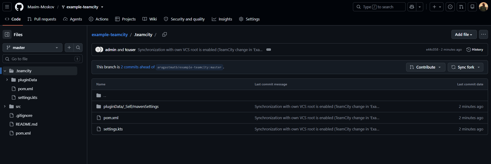
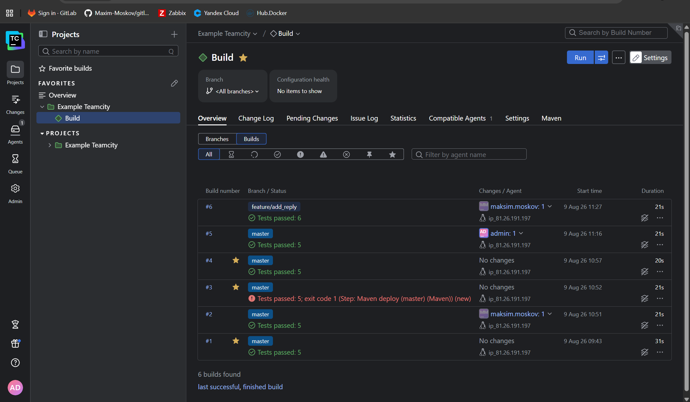
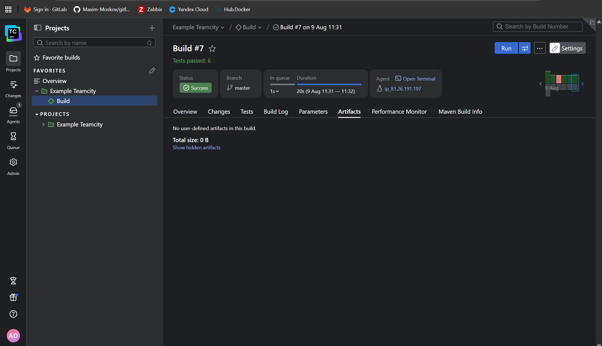
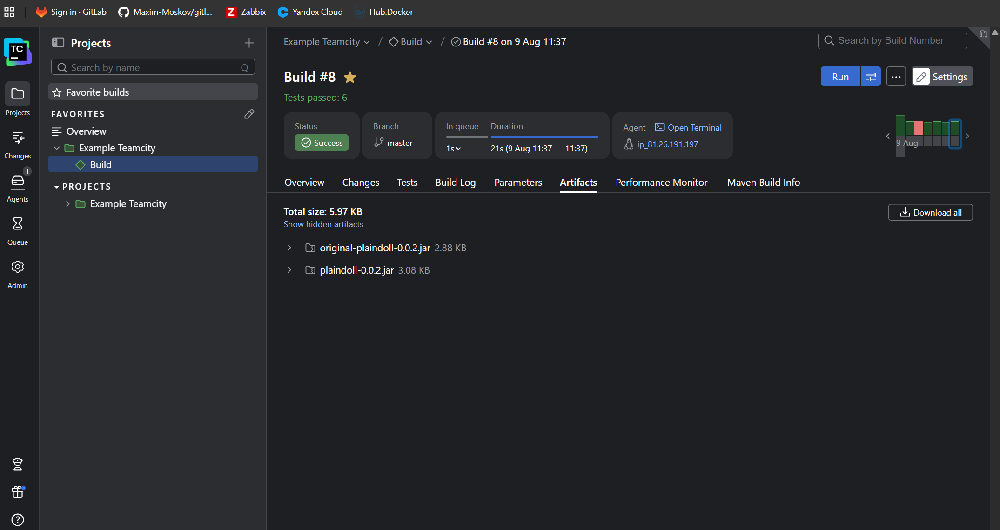
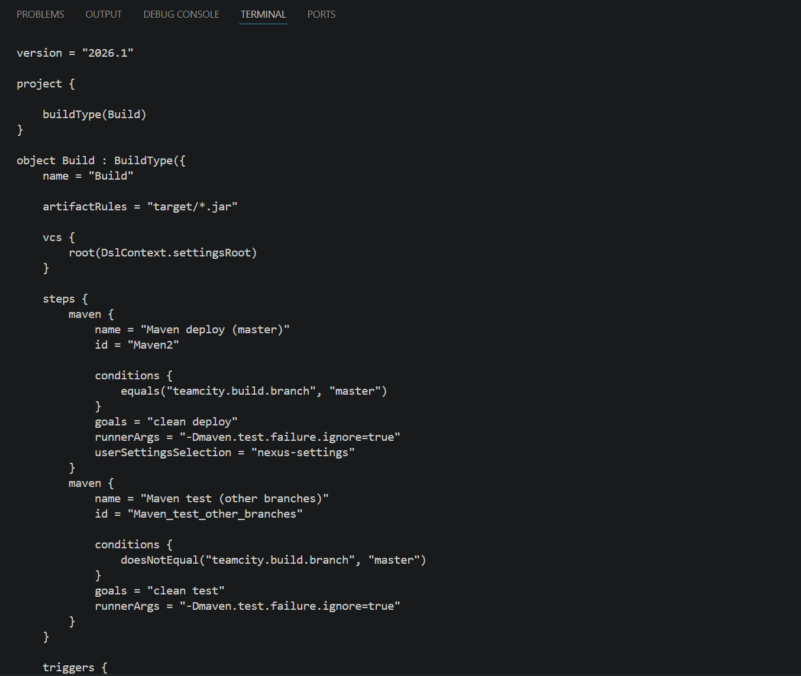

# Домашнее задание к занятию «Teamcity» - Моськов Максим

Инфраструктура развёрнута в Yandex Cloud, сборка выполняется в TeamCity с деплоем артефакта в Nexus. Скриншоты — в каталоге `img/`.

## Инфраструктура

| Компонент         | Адрес                     | Ресурсы     | Описание                                        |
|-------------------|---------------------------|-------------|-------------------------------------------------|
| TeamCity Server   | `158.160.175.46:8111`     | 4 CPU / 4 GB | Docker-контейнер `jetbrains/teamcity-server`     |
| TeamCity Agent    | `81.26.191.197`           | 2 CPU / 4 GB | Docker-контейнер `jetbrains/teamcity-agent`      |
| Nexus             | `81.26.186.132:8081`      | 2 CPU / 4 GB | Установлен Ansible-плейбуком из задания          |

Все ВМ — Ubuntu 24.04, в одной подсети (`ru-central1-d`), группа безопасности открывает порты 22, 8111, 8081.

**Форк репозитория:** https://github.com/Maxim-Moskov/example-teamcity

## Подготовка

**TeamCity Server.** На ВМ установлен Docker, сервер запущен контейнером:

```bash
docker run -d --name teamcity-server \
  -v teamcity-data:/data/teamcity_server/datadir \
  -v teamcity-logs:/opt/teamcity/logs \
  -p 8111:8111 \
  jetbrains/teamcity-server
```

Выполнена первичная настройка: Data Directory, внутренняя БД (HSQLDB), лицензионное соглашение, создан администратор.

**TeamCity Agent.** На отдельной ВМ запущен агент с указанием адреса сервера через переменную окружения:

```bash
docker run -d --name teamcity-agent \
  -e SERVER_URL="http://158.160.175.46:8111" \
  -v teamcity-agent-conf:/data/teamcity_agent/conf \
  jetbrains/teamcity-agent
```

Агент зарегистрировался на сервере и был авторизован через веб-интерфейс (Agents → Unauthorized → Authorize):



**Nexus.** Развёрнут Ansible-плейбуком `infrastructure/site.yml` из репозитория задания. В `inventory/cicd/hosts.yml` прописан адрес ВМ и пользователь:

```yaml
all:
  hosts:
    nexus-01:
      ansible_host: 81.26.186.132
  children:
    nexus:
      hosts:
        nexus-01:
  vars:
    ansible_user: yc-user
    ansible_python_interpreter: /usr/bin/python3
```

При запуске плейбука пришлось внести правки под Ubuntu (исходный плейбук написан под RHEL):

1. **Имена пакетов JDK**: `java-1.8.0-openjdk`, `java-1.8.0-openjdk-devel` → `openjdk-8-jdk`.
2. **Установка пакета `acl`** на целевой хост — без него Ansible не может переключиться на непривилегированного пользователя `nexus` (ошибка «Failed to set permissions on the temporary files»).
3. **Замена модуля `get_url` на `curl`** в задаче скачивания Nexus — модуль `get_url` из Ansible 2.14 несовместим с Python 3.12 в Ubuntu 24.04 (ошибка `HTTPSConnection.__init__() got an unexpected keyword argument 'cert_file'`).

После правок плейбук отработал полностью, Nexus доступен на порту 8081.

---

## Основная часть

### Пункты 1–3. Создание проекта и первая сборка

В TeamCity создан проект на основе форка, конфигурация определена через autodetect — TeamCity распознал Maven-проект и предложил шаг сборки с целью `clean test`. Шаг сохранён, запущена первая сборка ветки `master`:



Сборка прошла успешно, тесты: 5 passed.

### Пункт 4. Условная сборка по ветке

Требовалось: на ветке `master` выполнять `mvn clean deploy`, на остальных — `mvn clean test`.

Реализовано двумя build steps с parameter-based условиями выполнения по параметру `teamcity.build.branch`:

| Шаг                            | Goals          | Условие выполнения                             |
|--------------------------------|----------------|------------------------------------------------|
| `Maven deploy (master)`        | `clean deploy` | `teamcity.build.branch equals master`          |
| `Maven test (other branches)`  | `clean test`   | `teamcity.build.branch does not equal master`  |

На каждой сборке выполняется ровно один шаг, второй пропускается с сообщением `is skipped because of unfulfilled condition`.

### Пункт 5. Настройки Maven с кредами Nexus

Файл `settings.xml` из репозитория задания содержит секцию с учётными данными для сервера с id `nexus`:

```xml
<server>
  <id>nexus</id>
  <username>admin</username>
  <password>admin123</password>
</server>
```

Файл загружен в TeamCity (Build Step → User Settings → Manage settings files) под именем `nexus-settings` и выбран в поле **User settings selection** шага `Maven deploy (master)`:



### Пункт 6. Правка pom.xml

В `pom.xml` в секции `<distributionManagement>` адрес репозитория заменён на адрес собственного Nexus:

```xml
<distributionManagement>
    <repository>
        <id>nexus</id>
        <url>http://81.26.186.132:8081/repository/maven-releases</url>
    </repository>
</distributionManagement>
```

Идентификатор `nexus` совпадает с id сервера в `settings.xml` — по нему Maven подставляет логин и пароль при деплое.

### Пункт 7. Сборка master и артефакт в Nexus

При первом запуске деплой упал с ошибкой:

```
status code: 400, reason phrase: Repository does not allow updating assets: maven-releases (400)
```

Причина: у hosted-репозитория `maven-releases` политика **Disable redeploy**, а версия `0.0.2` уже была загружена. Для учебного стенда в настройках репозитория (Nexus → Settings → Repositories → maven-releases) политика изменена на **Allow redeploy**. (В продакшене так делать не следует — релизные версии должны быть неизменяемыми; правильнее повышать версию в `pom.xml`.)

После этого сборка прошла успешно, артефакты загружены в Nexus:





### Пункт 8. Миграция build configuration в репозиторий

Включены **Versioned Settings** (Project Settings → Versioned Settings):
- Synchronization enabled
- VCS root — форк репозитория
- Settings format — **Kotlin**
- Settings path in VCS — `.teamcity`

При первой попытке коммита возникла ошибка `Anonymous authentication has failed` — VCS root был настроен без учётных данных (для чтения публичного репозитория они не нужны, но для записи настроек обязательны). В VCS root добавлена аутентификация **Password / access token** с GitHub PAT, после чего настройки успешно закоммичены в репозиторий:



### Пункты 9–13. Новая ветка, метод и тест

Создана ветка `feature/add_reply`. В класс `Welcomer` добавлен новый метод, возвращающий реплику со словом `hunter`:

```java
public String sayGoodLuck(){
    return "Good luck, hunter. The night is long, but you are not alone.";
}
```

В `WelcomerTest` добавлен тест на поиск слова `hunter` в новой реплике:

```java
@Test
public void welcomerSaysGoodLuckToHunter() {
    assertThat(welcomer.sayGoodLuck(), containsString("hunter"));
}
```

Изменения запушены в ветку. Благодаря VCS-триггеру с фильтром `+:*` сборка запустилась **автоматически**. В логе видно, что отработало условие ветки:

```
Build step Maven deploy (master) (Maven) is skipped because of unfulfilled condition: "teamcity.build.branch equals master"
Step 2/2: Maven test (other branches) (Maven)
...
Tests run: 6, Failures: 0, Errors: 0, Skipped: 0
```

То есть на feature-ветке выполнился только `clean test`, деплой пропущен. Тесты: 6 passed (5 старых + новый).



### Пункты 14–15. Merge в master и отсутствие артефактов

Изменения влиты в `master` через merge:

```bash
git checkout master
git merge feature/add_reply
git push
```

Сборка master запустилась автоматически и прошла успешно, но вкладка **Artifacts** пуста — `No user-defined artifacts in this build`, Total size 0 B:



Причина: `mvn deploy` загружает jar в **Nexus**, но TeamCity не публикует файлы сборки как собственные build artifacts, пока это не указано явно в настройках конфигурации.

### Пункты 16–17. Публикация .jar в артефакты

В General Settings конфигурации задано правило:

```
Artifact paths: target/*.jar
```

После повторной сборки master артефакты появились — `plaindoll-0.0.2.jar` (3.08 KB) и `original-plaindoll-0.0.2.jar`:



### Пункт 18. Проверка конфигурации в репозитории

Все настройки из TeamCity автоматически синхронизированы в `.teamcity/settings.kts`:

```kotlin
object Build : BuildType({
    name = "Build"
    artifactRules = "target/*.jar"

    vcs {
        root(DslContext.settingsRoot)
    }

    steps {
        maven {
            name = "Maven deploy (master)"
            id = "Maven2"
            conditions {
                equals("teamcity.build.branch", "master")
            }
            goals = "clean deploy"
            runnerArgs = "-Dmaven.test.failure.ignore=true"
            userSettingsSelection = "nexus-settings"
        }
        maven {
            name = "Maven test (other branches)"
            id = "Maven_test_other_branches"
            conditions {
                doesNotEqual("teamcity.build.branch", "master")
            }
            goals = "clean test"
            runnerArgs = "-Dmaven.test.failure.ignore=true"
        }
    }

    triggers {
        vcs {
        }
    }
})
```

В файле присутствуют оба build step с условиями по ветке, правило артефактов, VCS root и триггер — конфигурация полностью соответствует настройкам в TeamCity.



---

## Итог

Выполнены все пункты задания: развёрнута инфраструктура (TeamCity server, agent, Nexus), создан проект с autodetect-конфигурацией, настроена условная сборка по ветке (`deploy` для master, `test` для остальных), подключены Maven-настройки с кредами Nexus, артефакт деплоится в Nexus, конфигурация мигрирована в репозиторий в формате Kotlin DSL, проверена автоматическая сборка feature-ветки и публикация `.jar` в артефакты сборки.

После сдачи все виртуальные машины в Yandex Cloud удалил.